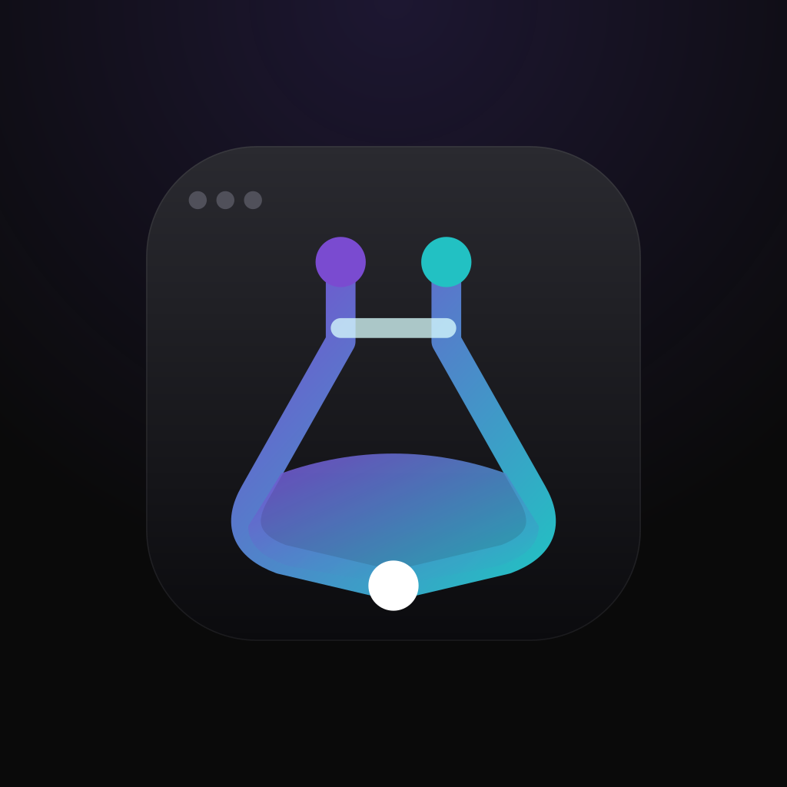

<div align="center">



# OhLab

OhLab is a fork of nodeterm that puts coding agents and real terminals on an infinite
canvas. This repository is also where the cross-machine team hub is being built, so
your agents can collaborate with your teammates' agents across machines.

[%20·%20Linux%20(x64)%20·%20Windows%20(x64%2C%20beta)-black)](https://github.com/Cardenas-SA-SL/OhLab)
[](https://www.electronjs.org/)
[](./LICENSE)
[](https://github.com/Cardenas-SA-SL/OhLab/stargazers)
[](https://github.com/Cardenas-SA-SL/OhLab/releases)

[Install](#-install) · [Docs](https://github.com/Cardenas-SA-SL/OhLab/tree/main/docs) · [Features](#-features) · [Build from source](#-build-from-source) · [Architecture](#-architecture) · [License](#-license)

</div>

---

<div align="center">
  <a href="docs/assets/hero-tour.mp4">
    
  </a>
  <br/>
  <sub>▶ <a href="docs/assets/hero-tour.mp4">Watch the 30-second tour with sound</a></sub>
</div>

## Attribution and license

OhLab is a fork of [nodeterm by Enes Kirca](https://github.com/eneskirca/nodeterm).
It remains licensed under BUSL-1.1; under the upstream license terms, each release
converts to the MIT License four years after its upstream publication date. See
[LICENSE](./LICENSE) and [THIRD-PARTY-NOTICES.md](./THIRD-PARTY-NOTICES.md).

## Why OhLab

Stacked terminal tabs hide context — you lose track of what's running where. OhLab
turns that into a **map**: every shell is a node you can place, group, label, and zoom
into. Sessions are spatial and persistent, so your mental model stays intact across
restarts. And because the app is built around a clean service seam, the same canvas runs
three ways — as the **desktop app for macOS, Linux and Windows (beta)**, as a **self-hosted browser app**
you reach from anywhere (Server Edition), and an **iOS companion** that attaches to the
same live sessions.

📚 **Full documentation lives in [the docs directory](https://github.com/Cardenas-SA-SL/OhLab/tree/main/docs)** — get
started, concepts, agents, remote access, troubleshooting.

## Team

Host a Hub inside OhLab, share one project with an invite code, approve teammates, and open each other's projects as live tabs across machines. Start with the [two-computer walkthrough and Tailscale setup](./docs/HUB.md).

## ✨ Features

<table>
<tr>
<td width="42%" valign="middle">

### Everything is a node

Right-click the canvas to open a **terminal** — or an AI **agent**. Each runs in its own
persistent tmux session, next to **sticky notes** (link one to feed an agent context),
**Monaco editors**, **diff views**, and **web/video** nodes — arranged spatially, like a
map. Quit the app, even **restart the machine** — every session comes back.

</td>
<td></td>
</tr>
<tr>
<td width="42%" valign="middle">

### Know when an agent needs you

Hook-driven status — no output scraping: pulsing **RUNNING / NEEDS YOU** badges,
**subagent** cards with live transcripts, a per-node **context meter**, and OS
notifications. Click the ping, answer the permission prompt right in the node, and get
told the moment the turn is **done**. On a MacBook, agents live in the **notch** too.

</td>
<td></td>
</tr>
<tr>
<td width="42%" valign="middle">

### One project, two views

Every project is a canvas — **and also a kanban board**. Cards *are* your live
sessions: drag them across columns while the agent keeps running, open a card into a
**live card modal** (the real session + members, due date, priority, comments), and
assign teammates. Toggle with `⌘⇧B`.
<br/><sub>▶ <a href="docs/assets/kanban-launch.mp4">Watch the board video with sound</a></sub>

</td>
<td></td>
</tr>
<tr>
<td width="42%" valign="middle">

### Your sessions, anywhere

**Pair your phone** with one QR — *scan with the mobile companion* — and the **same
live session continues in your pocket**, E2E encrypted **over the relay, not just your
LAN**. The same canvas also runs self-hosted in any browser (Server Edition).

</td>
<td></td>
</tr>
<tr>
<td width="42%" valign="middle">

### Talk to your terminal

Hold `⌘⌥` and say it. On-device **Whisper** transcribes locally — review the text,
then **Send** (nothing auto-submits). Your voice never leaves the machine.

</td>
<td></td>
</tr>
</table>

### Node kinds

🖥 **Terminal** (xterm + tmux, AI naming) · 🤖 **Agent** (Claude Code / Codex / Gemini /
GitHub Copilot / opencode / Grok / custom) · 📝 **Sticky note** (link to an agent as context) · 🗂 **Group**
(bind to a **git worktree** for agent-per-branch) · ✏️ **Editor** (Monaco, ⌘S) ·
🔀 **Diff** · 🌐 **Web / Video**

### More

- **Session continuity (tmux)** — terminals keep running across node remounts *and* full
  app restarts, including live processes; machine reboots restore scrollback and resume
  agent sessions (`claude --resume`). The macOS app **ships its own tmux**, so this works
  with nothing installed; a tmux already on your system is always used in preference to it,
  and terminals opened before an upgrade stay as they were until you refresh the node.
- **Agent superpowers** — **context links** so agent nodes read each other's transcripts
  on demand; Claude-only **branch a conversation** and **managed accounts** for several
  logged-in Claude identities side by side; agents can drive the canvas (open nodes,
  spawn teams, verify each other's work) via the built-in canvas-control CLI.
- **Remote / SSH projects** — open a project on a remote host over SSH; terminals, files,
  git, and even the board run there while the canvas stays local.
- **Source control** — VS Code-style stage/unstage, discard, branch switch/create,
  commit, push/sync/publish, **worktrees**, and `gh` sign-in — backed by system `git`.
- **GitHub Issues on Kanban** – opt-in issue cards, exact label-to-column mapping,
  All / GitHub / Sessions filtering, and two-way move, close, and reopen sync. See
  [setup and security details](./docs/github-issues-kanban.md).
- **AI commit messages & terminal names** — bring-your-own local agent CLI run read-only
  on the staged diff or captured output.
- **Your sessions, in your pocket** — the **mobile companion** (iOS) attaches to the same live
  tmux sessions: watch an agent work, answer a "needs you", or type into any terminal
  from your phone — plus push notifications and a mobile board view.
- **Power & sleep** — while an agent is working, OhLab keeps the machine from
  idle-sleeping, and lets go the moment it finishes (on by default; toggle in the setup
  tour or Settings → Behavior). No app can hold a machine awake through a closed lid —
  for overnight runs keep the laptop open and plugged in, or run the agents on a box
  that doesn't sleep via the [Server Edition](./docs/SERVER.md).
- **Command palette** (⌘K), **file explorer** (⌘⇧E), **markdown view** (⌘M),
  **undo/redo**, and a native macOS dark UI.
- **Auto-update & in-app announcements** — the app checks GitHub-hosted feeds and
  surfaces a "Restart to update" banner and product news.

### 🌍 Server Edition — OhLab in your browser

The same canvas runs headless on a Linux (or macOS) host and is used from any browser —
so your terminals, editors, source control, board, and agents live on a server you reach
from anywhere. Single-user auth (password + secure cookie), a WebSocket bridge, and the
exact same renderer as the desktop app.

```bash
npm run server:dev     # build + serve; open http://127.0.0.1:8443 and set a password
```

Terminals, files/editor/diff, the full git panel, the kanban board, and agent-status
badges all work in the browser today. See [`docs/SERVER.md`](./docs/SERVER.md) for the
quickstart, security model, and current limitations.

#### 🔔 Get push notifications from any SSH host

The same server also runs **headless** as a background notification host: install it on any
Linux box you SSH into, and your phone gets **RUNNING / NEEDS YOU** push + Live-Activity
coverage for the agents running there — with **zero open ports** (the hook server stays
loopback-only and push goes out over HTTPS under a grant your phone drops over SSH).

```bash
curl -fsSL https://raw.githubusercontent.com/Cardenas-SA-SL/OhLab/main/scripts/install-server.sh | bash
```

One line installs, builds, and runs it as a systemd service (`NODETERM_HEADLESS=1`); re-run it
to update. See the [headless notification host](./docs/SERVER.md#headless-notification-host)
section for details.

## 📦 Install

Packaged builds are published on the [OhLab releases page](https://github.com/Cardenas-SA-SL/OhLab/releases).
To install from source, clone this repository and run:

```bash
npm install
npm run dev
npm run dist
```

## 🛠 Build from source

Requires Node.js 20+ on macOS or Linux (tmux recommended — it's what makes sessions
survive restarts). A source checkout does **not** carry the bundled tmux: run
`node scripts/build-tmux.mjs` once on macOS to build it into `resources/bin/tmux` (the
release job does this automatically), or just install tmux yourself. On **Windows**, run
`bootstrap-windows.bat` from a fresh checkout first — it checks for Node, the Visual Studio
C++ build tools and Python 3 (needed to compile node-pty) and points you at the exact
`winget` commands for anything missing, then runs `npm ci`.

```bash
npm install        # deps + rebuilds node-pty against Electron's ABI (postinstall)
npm run dev        # dev mode with renderer HMR
npm run build      # production build into out/
npm start          # preview the production build
npm run typecheck  # fastest correctness gate
npm test           # vitest unit + integration suite
npm run dist       # local UNSIGNED .dmg into dist/ (smoke test)
npm run dist:linux # AppImage + .deb into dist/ (on a Linux host)
npm run dist:win   # unsigned NSIS installer + zip into dist/ (on a Windows host)
npm run server:dev # build + run the browser Server Edition (needs Node 22 + tmux)
```

## ⌨️ Keyboard shortcuts

These are the defaults — every one of them is remappable in **Settings → Keyboard Shortcuts**.

| Shortcut | Action |
| --- | --- |
| `⌘K` | Command palette |
| `⌘T` / `⌘⇧C` | New terminal / New Claude Code |
| `⌘⇧B` | Toggle the kanban board |
| `⌘W` | Close the selected node |
| `⌘←` `⌘→` `⌘↑` `⌘↓` | Focus the node left / right / above / below (`Ctrl+Shift+arrow` off macOS) |
| `⌘Z` / `⌘⇧Z` | Undo / Redo |
| `⌘M` | Toggle markdown view (terminal / editor) |
| Hold `⌘⌥` (`Ctrl+Alt`) | Dictate into the focused terminal |
| `⌘⇧E` | File explorer |
| `⌘,` | Settings · `⌘/` Shortcuts |
| `Right-click` | Actions menu (empty space or node) |

## 🏗 Architecture

- **Electron, three contexts** — `src/main` (the Electron shell), `src/preload` (the only
  bridge, `window.nodeTerminal`), `src/renderer` (React UI). `src/shared` holds the types
  and IPC channel names used by all three.
- **`CorePlatform` seam** — every service (PTY, workspace/settings, git, agents, hooks) lives
  in `src/core` behind a small platform interface and never imports `electron`. Electron is
  one implementation of that seam; the browser Server Edition (`src/server`) is another,
  booting the exact same services over a WebSocket-RPC bridge (`src/renderer/bridge` fills
  `window.nodeTerminal` in the browser). One codebase, one renderer, multiple shells.
- **`TerminalTransport` abstraction** — the renderer depends only on this interface, never on
  IPC or node-pty directly. `LocalTransport` talks to the local host; `RemoteTransport` talks
  to a remote agent over SSH — so remote projects drop in without touching the canvas UI.
- **React Flow is the single source of truth** for live nodes; projects persist serialized
  nodes to disk, and tmux keeps sessions alive across restarts.
- **Three surfaces** — the desktop app, the browser **Server Edition**, and the
  **mobile companion** (a separate SwiftUI repo) all ride the same core + transport seams.

See [`docs/SERVER.md`](./docs/SERVER.md) for the Server Edition, and the design docs
under [`docs/`](./docs) for deeper notes.

## 🤝 Contributing

Issues and pull requests are welcome. **Start with [CONTRIBUTING.md](./CONTRIBUTING.md)** —
setup, the process-boundary rules, and the house rules that come up in review.
[CLAUDE.md](./CLAUDE.md) is the deep reference behind them (and is loaded automatically if
you work with an AI coding agent). Questions and bug reports are welcome in
[GitHub Issues](https://github.com/Cardenas-SA-SL/OhLab/issues). OhLab is licensed under the
[Business Source License 1.1](https://mariadb.com/bsl11/) — you can use, modify,
and redistribute it freely, including in production, except offering it as a
competing product or service (see [License](#-license)).

By submitting a contribution (pull request, patch, or code snippet), you agree
that it is licensed under the same [BUSL-1.1](./LICENSE) terms as the rest of
the project, and that the project may continue to relicense future versions
(including your contribution) as part of its normal licensing model.

## 📜 License

**[BUSL-1.1](./LICENSE)** ([Business Source License](https://mariadb.com/bsl11/)): you may
copy, modify, redistribute, and — under the Additional Use Grant — make **production
use** of OhLab; the one thing you may not do is offer it (hosted, embedded, or as a
standalone product/service) in a way that **competes** with the Licensed Work or the
Licensor's products built on it. Each release automatically becomes plain **MIT** four
years after its upstream publication. See [`LICENSE`](./LICENSE) for the full terms and
[`THIRD-PARTY-NOTICES.md`](./THIRD-PARTY-NOTICES.md) for the bundled open-source
components. For a commercial license beyond the grant, contact eneskirca@gmail.com.

> "Claude" and "Claude Code" are trademarks of Anthropic, and "Trello" is a trademark of
> Atlassian; OhLab is not affiliated with or endorsed by either.
